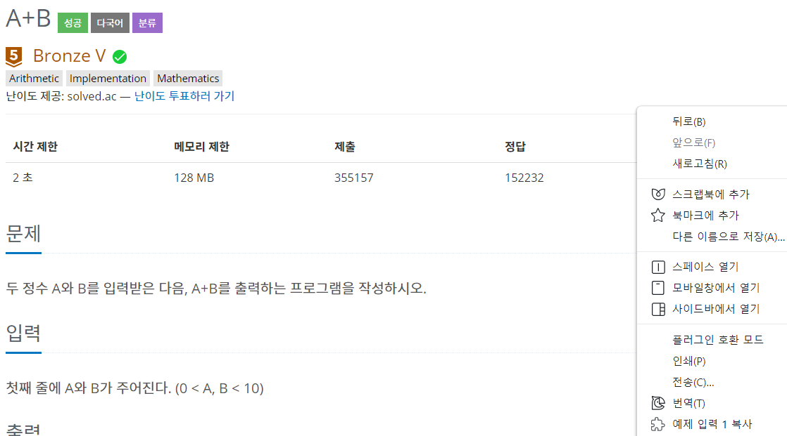
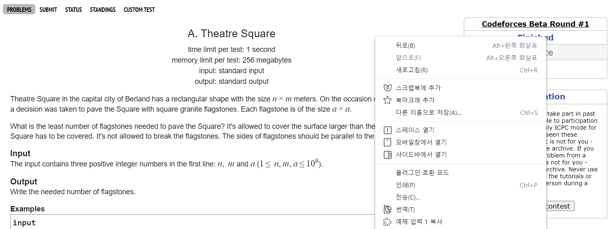

# timeCP
tools for CP

# Feature
## Fast Copy Test Case (2021.01.20)
### example
|
:--:|:--:
*simple usage(boj)*|*simple usage(cf)*
### usage1
- just for test case input 1
- right click on page, and click "예제 입력 1 복사"
### usage2(short-cut)
- `Ctrl+Shift+1` to copy test case 1 input 
- `Ctrl+Shift+2` to copy test case 2 input 
- `Ctrl+Shift+3` to copy test case 3 input
## Short-Cut of Codeforces Submit Button (2021.03.30)
### usage
- `Ctrl+Enter` to submit code
### Notice
- If it doesn't work, please **refresh the page**.
